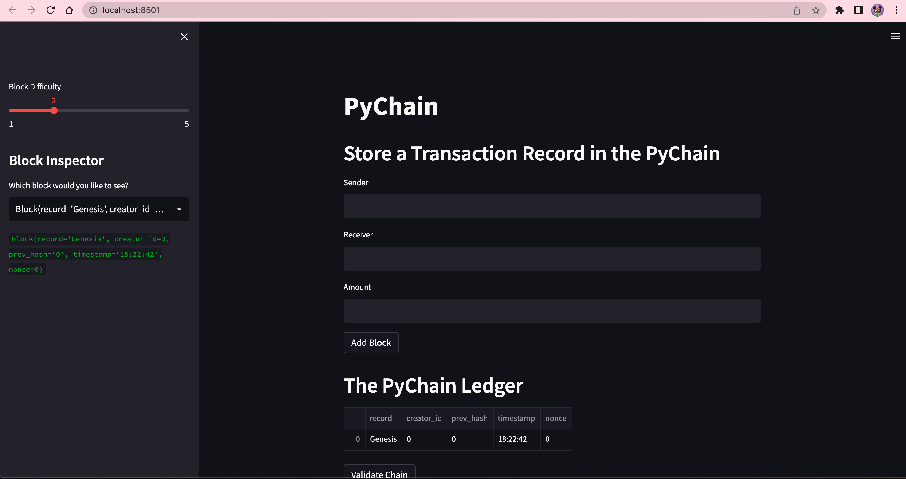
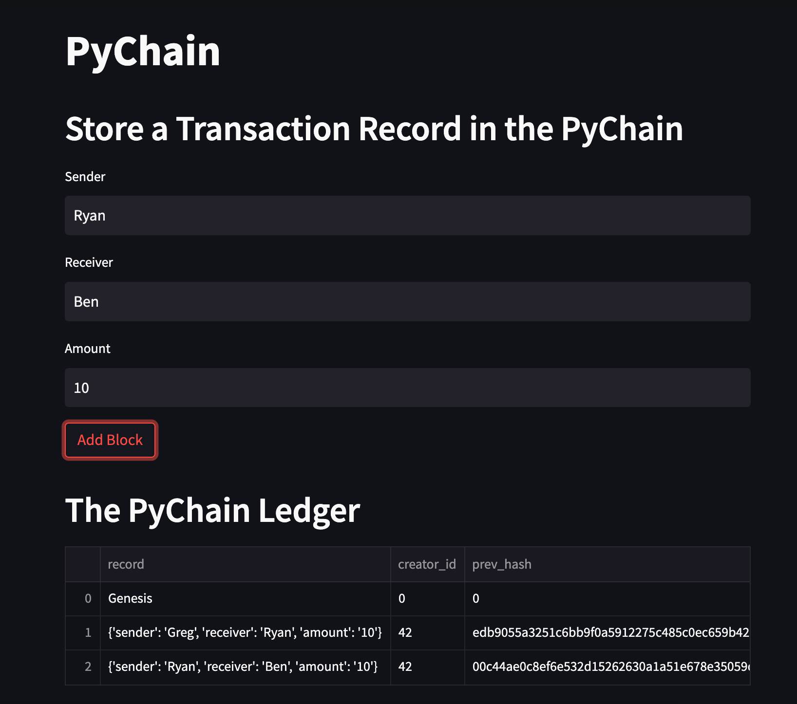
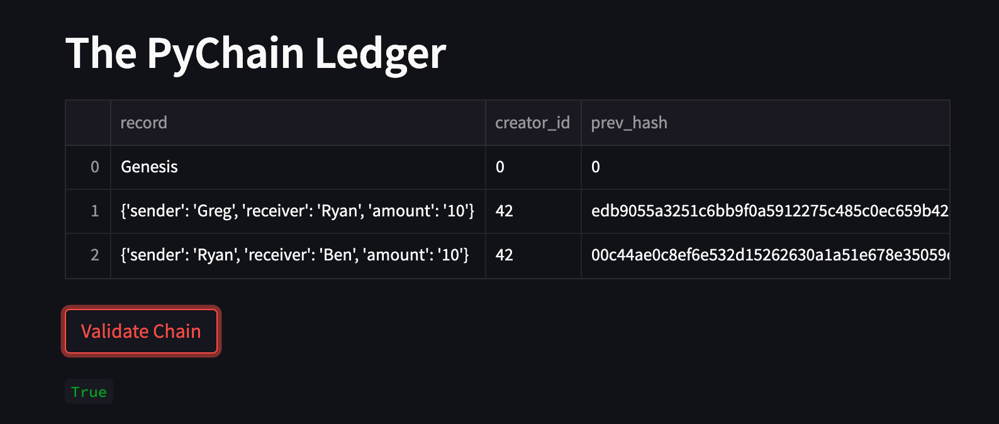

# Python Blockchain

---

## PROJECT OVERVIEW

This project is a blockchain-based ledger system built using Python, complete with a user-friendly web interface. The ledger for this application allows users to conduct financial transactions (to transfer money between senders and receivers) and to verify the integrity of the data in the ledger.

---

## INSTALLATION

1. Clone this repository by opening your terminal and entering the following commands:

```
  git clone https://github.com/jgrichardson/pychain.git
  cd pychain
```

2. Install the required pre-requisites / libraries

```
  pip install -r requirements.txt
```

## USAGE

This application runs as a python script (pychain.py) in the Streamlit app framework. Open your terminal and type:

```
  streamlit run pychain.py
```

Streamlit will open a browser and connect to the application at localhost:8501



Create a couple of transactions by entering a sender, receiver and amount and pressing the Add Block button.



Validate the blockchain by pressing the Validate Chain button. The chain will be valid if the word "True" is displayed below the button.



---

## License

The source code for the application is licensed under the MIT license, which you can find in the LICENSE file in this repo.

